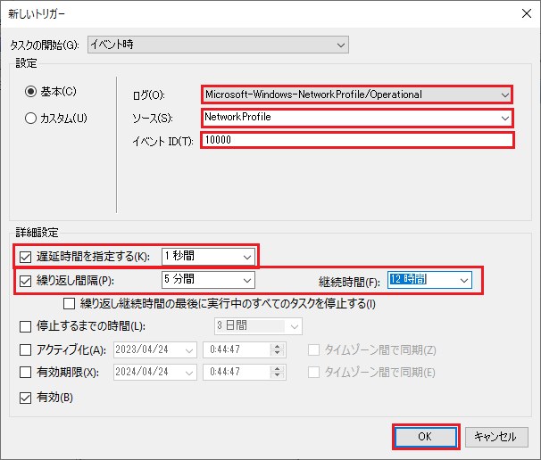

# Windowsで認証を自動化する

## 環境変数を設定する

> **Note**
> 環境変数を使わずに、実行時にIDとパスワードを入力することもできます。詳細は`--help`を参照してください。

1. コントロールパネルの「システムとセキュリティ」から「システム」を開き、「システムの詳細設定」を開きます。
2. 「環境変数」をクリックします。
3. 「ユーザー環境変数」に以下を追加します。
   - `TMGW_ID`: MyPCアカウントのID
   - `TMGW_PASSWORD`: MyPCアカウントのパスワード

## タスクを作成する

### タスクスケージューラ

1. コントロールパネルの「システムとセキュリティ」から「管理ツール」を開き、「タスクスケージューラ」を起動します。
2. メニューバーの「操作」から「タスクの作成」を選択します。

### 全般タブ

1. 任意の名前を入力します。

2. 「ユーザーがログオンしているかどうかにかかわらず実行する」にチェックを入れます。

### トリガータブ

1. 「新規」をクリックします。

2. 「イベント時」を選択します。
3. 設定に以下を入力します。
   - ログ: `Microsoft-Windows-NetworkProfile/Operational`
   - ソース: `NetworkProfile`
   - イベントID: `10000`
4. 「遅延時間を指定する」にチェックを入れ、`1秒間`を指定します。
5. 「繰り返し間隔」にチェックを入れ、`5分間`を指定し、継続時間を`12時間`にします。

### 操作タブ

1. 「新規」をクリックします。

2. 「プログラム/スクリプト」の参照ボタンをクリックし、`tmgw-wifi-authorizer`の実行ファイルを選択します。

### 条件タブ

1. 「コンピュータをAC電源に接続している場合のみ実行する」のチェックを外します。

### 設定タブ

1. 「タスクが既に実行中の場合に適用される規則」を`既存のインスタンスの停止`にします。
2. OKボタンをクリックします。